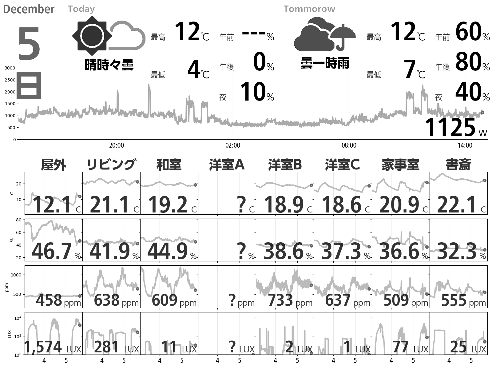

# E-Ink Weather Panel

## 概要

電子ペーパディスプレイに，Raspberry Pi を通じて下記の情報を表示するためのスクリプトです．

-   天気予報
-   各種センサーの情報

## デモ

表示サンプルは下記になります．



実際にリアルタイムに画像を生成する様を下記で確認いただけます．

https://weather-panel-webapp-demo.kubernetes.green-rabbit.net/weather_panel/

## 詳細

大きく次の処理を行います．

-   Yahoo から天気予報の情報を取得
-   気象庁のページから雨雲画像を取得
-   Influx DB からセンサー情報を取得
-   センサ情報を Matplotlib で描画
-   夜間，照度に応じてライトのアイコンを描画
-   Raspberry Pi にログインして，フレームバッファに描画

## 準備

### ライブラリのインストール

```bash:bash
apt-get install -y python3 python3-pip
apt-get install -y python3-yaml python3-coloredlogs
apt-get install -y python3-pil python3-matplotlib python3-pandas
apt-get install -y python3-opencv
apt-get install -y python3-paramiko
pip3 install -r requirements.txt
```

後述する Docker を使った方法で実行する場合は，インストール不要です．

また，Raspberry Pi 側では下記を行っておきます．

```bash:bash
apt-get install -y fbi
```

## 設定

### 設定ファイルの編集

`config.yaml` に記述します．サンプルを `config.example.yaml` として登録してありますので参考にしてください．

Raspberry Pi のホスト名については，`docker-compose.yaml` の RASP_HOSTNAME にて設定します．

Influx DB からセンサー情報を取得する部分( `sensor_data.py` の `fetch_data` )はお手元の環境に合わせて修正が必要かもしれません．

### Raspberry Pi の解像度変更

Raspberry Pi から電子ペーパデバイスの解像度で HDMI 出力するため，
`/boot/firmware/config.txt` に設定を記載します．

設定例を紹介します．

BOOX Mira Pro の場合，解像度が 3200x1800 なので，次のようにします．

```text
framebuffer_width=3200
framebuffer_height=1800
max_framebuffer_width=3200
max_framebuffer_height=1800
hdmi_group=2
hdmi_mode=87
hdmi_timings=3200 1 48 32 80 1800 1 3 5 54 0 0 0 10 0 183422400 3
```

BOOX Mira 33 の場合，解像度が 2200x1650 なので，次のようにします．

```text
framebuffer_width=2200
framebuffer_height=1650
max_framebuffer_width=2200
max_framebuffer_height=1650
hdmi_group=2
hdmi_mode=87
hdmi_timings=2200 1 48 32 80 1650 1 3 5 54 0 0 0 10 0 160000000 1
```

### Raspberry Pi の画面消灯禁止

`/boot/firmware/cmdline.txt` に `consoleblank=0` を追記して画面が消灯しないようにします

### 描画用 SSH 公開鍵のコピー

`display_image.py` は Raspberry Pi にログインする際に，`key/panel.id_rsa` を使います．
そのため，次のようにして秘密鍵を Raspberry Pi にコピーしておきます．

```bash
ssh-copy-id -i key/panel.id_rsa.pub ubuntu@"Raspberry Pi のホスト名"
```

Raspberry Pi が外部からアクセスできる場合，SSH 用の鍵は再生成お願いします．

## 実行方法

```bash
./src/display_image.py
```

Docker で実行する場合，下記のようにします．

```bash
docker-compose build
docker-compose up -d
```

## テスト結果

-   https://kimata.github.io/e-ink_weather_panel/
-   https://kimata.github.io/e-ink_weather_panel/coverage/
