# E-Ink Weather Panel

[](https://github.com/kimata/e-ink_weather_panel/actions/workflows/regression.yaml)

> **総合気象パネル for E-Ink Display**
> Raspberry Pi と E-Ink ディスプレイで構築する、包括的な気象情報表示システム

## 📖 目次

- [✨ 特徴](#-特徴)
- [🎯 デモ](#-デモ)
    - [表示サンプル](#表示サンプル)
    - [ライブデモ](#ライブデモ)
- [🔧 システム構成](#-システム構成)
    - [主要コンポーネント](#主要コンポーネント)
- [🚀 クイックスタート](#-クイックスタート)
    - [必要要件](#必要要件)
    - [インストール](#インストール)
    - [実行方法](#実行方法)
- [⚙️ 設定](#️-設定)
    - [基本設定](#基本設定)
    - [センサーデータのカスタマイズ](#センサーデータのカスタマイズ)
- [🖥️ Raspberry Pi セットアップ](#️-raspberry-pi-セットアップ)
    - [対応E-Inkディスプレイ](#対応e-inkディスプレイ)
    - [基本セットアップ](#基本セットアップ)
- [☁️ デプロイメント](#️-デプロイメント)
    - [Docker Compose](#docker-compose)
    - [Kubernetes](#kubernetes)
- [📊 テスト](#-テスト)
    - [テスト実行](#テスト実行)
    - [CI/CD状況](#cicd状況)
- [🛠️ 開発者向け](#️-開発者向け)
    - [アーキテクチャ](#アーキテクチャ)
    - [コントリビューション](#コントリビューション)
- [📄 ライセンス](#-ライセンス)

## ✨ 特徴

- 🌤️ **多彩な気象情報** - Yahoo Weather API、気象庁雨雲レーダー、ローカルセンサーデータを統合表示
- 📊 **高度な可視化** - 温度・湿度・照度・電力消費をリアルタイムグラフ表示
- 🎨 **E-Ink最適化** - グレースケール表示に最適化されたレイアウトとフォント
- 🌐 **Web インターフェース** - React製のWebアプリで画像生成とプレビュー機能
- ☁️ **クラウドネイティブ** - Docker/Kubernetes対応で運用環境を選ばない

## 🎯 デモ

### 表示サンプル


### ライブデモ

リアルタイム画像生成を体験できます:
https://weather-panel-webapp-demo.kubernetes.green-rabbit.net/weather_panel/

## 🔧 システム構成

```mermaid
graph TB
    A[Weather Panel App] --> B[Yahoo Weather API]
    A --> C[気象庁雨雲レーダー]
    A --> D[InfluxDB センサーデータ]
    A --> E[Raspberry Pi + E-Ink Display]

    F[React Web UI] --> A
    G[Docker/Kubernetes] --> A
```



### 主要コンポーネント

| 機能               | 説明                                       | 実装                  |
| ------------------ | ------------------------------------------ | --------------------- |
| **天気予報**       | Yahoo Weather APIから詳細な気象予報を取得  | `weather_panel.py`    |
| **雨雲レーダー**   | 気象庁から最新の降水レーダー画像を取得     | `rain_cloud_panel.py` |
| **センサーグラフ** | InfluxDBから温度・湿度・照度データを可視化 | `sensor_graph.py`     |
| **電力監視**       | 消費電力の履歴とトレンド分析               | `power_graph.py`      |
| **WBGT指数**       | 熱中症警戒レベルの算出と表示               | `wbgt_panel.py`       |
| **Web API**        | React フロントエンドとの連携               | `webapp.py`           |

## 🚀 クイックスタート

### 必要要件

| 項目         | 最小要件 | 推奨         |
| ------------ | -------- | ------------ |
| **Python**   | 3.12+    | 3.13+        |
| **OS**       | Linux    | Ubuntu 24.04 |
| **メモリ**   | 1GB      | 2GB+         |
| **ディスク** | 500MB    | 1GB+         |

### インストール

1. **リポジトリのクローン**

    ```bash
    git clone https://github.com/kimata/e-ink_weather_panel.git
    cd e-ink_weather_panel
    ```

2. **設定ファイルの準備**

    ```bash
    cp config.example.yaml config.yaml
    cp config-small.example.yaml config-small.yaml
    # お手元の環境に合わせて編集
    ```

3. **依存関係のインストール**
    ```bash
    # UV使用
    uv sync
    ```

### 実行方法

#### 🐳 Docker Compose (推奨)

```bash
# React フロントエンドをビルド
cd react && npm ci && npm run build && cd -

# サービス起動
docker compose up --build
```

#### 🔧 ローカル開発

```bash
# 画像生成と表示
env RASP_HOSTNAME="your-raspi-hostname" uv run python src/display_image.py

# Web サーバー起動
uv run python src/webapp.py

# テスト実行
uv run pytest tests/test_basic.py
```

## ⚙️ 設定

### 基本設定

メインの設定ファイル `config.yaml` では以下を設定します：

```yaml
panel:
    device:
        width: 3200 # ディスプレイ幅
        height: 1800 # ディスプレイ高さ

influxdb:
    url: "http://your-influxdb:8086"
    org: "your-org"
    bucket: "sensor-data"
    token: "your-token"

weather:
    location: "東京都"
    yahoo_app_id: "your-yahoo-app-id"
```

### センサーデータのカスタマイズ

InfluxDBスキーマに合わせて調整が必要な場合：

- `src/weather_display/sensor_graph.py` - センサーデータ取得ロジック
- `src/weather_display/power_graph.py` - 電力データ処理

## 🖥️ Raspberry Pi セットアップ

### 対応E-Inkディスプレイ

| モデル            | 解像度    | 設定値 | 備考             |
| ----------------- | --------- | ------ | ---------------- |
| **BOOX Mira Pro** | 3200×1800 | ✅     | 大型・高解像度   |
| **BOOX Mira**     | 2200×1650 | ✅     | 中型・省スペース |

### 基本セットアップ

1. **必要パッケージのインストール**

    ```bash
    sudo apt-get update
    sudo apt-get install -y fbi
    ```

2. **ディスプレイ解像度設定**

    `/boot/firmware/config.txt` に追加：

    **BOOX Mira Pro (3200×1800)**

    ```ini
    framebuffer_width=3200
    framebuffer_height=1800
    max_framebuffer_width=3200
    max_framebuffer_height=1800
    hdmi_group=2
    hdmi_mode=87
    hdmi_timings=3200 1 48 32 80 1800 1 3 5 54 0 0 0 10 0 183422400 3
    ```

    **BOOX Mira (2200×1650)**

    ```ini
    framebuffer_width=2200
    framebuffer_height=1650
    max_framebuffer_width=2200
    max_framebuffer_height=1650
    hdmi_group=2
    hdmi_mode=87
    hdmi_timings=2200 1 48 32 80 1650 1 3 5 54 0 0 0 10 0 160000000 1
    ```

3. **画面の消灯防止**

    ```bash
    # /boot/firmware/cmdline.txtに追加
    echo "consoleblank=0" | sudo tee -a /boot/firmware/cmdline.txt
    ```

4. **SSH認証設定**
    ```bash
    # SSH公開鍵をコピー
    ssh-copy-id -i key/panel.id_rsa.pub ubuntu@"your-raspi-hostname"
    ```

## ☁️ デプロイメント

### Docker Compose

```yaml
# compose.yaml の例
services:
    weather_panel:
        build: .
        environment:
            - RASP_HOSTNAME=your-raspi-hostname
        volumes:
            - ./config.yaml:/app/config.yaml
            - ./key:/app/key
```

### Kubernetes

```bash
# Kubernetesデプロイ
kubectl apply -f kubernetes/e-ink_weather_panel.yaml

# 設定の更新
kubectl create configmap weather-config --from-file=config.yaml
```

## 📊 テスト

### テスト実行

```bash
# 基本テスト
uv run pytest tests/test_basic.py

# カバレッジレポート生成
uv run pytest --cov=src --cov-report=html tests/

# 並列テスト
uv run pytest --numprocesses=auto tests/
```

### CI/CD状況

- **テスト結果**: [GitHub Actions](https://github.com/kimata/e-ink_weather_panel/actions)
- **カバレッジレポート**: [Coverage Report](https://kimata.github.io/e-ink_weather_panel/coverage/)
- **テスト詳細**: [Test Results](https://kimata.github.io/e-ink_weather_panel/)

## 🛠️ 開発者向け

### アーキテクチャ

```bash
src/
├── weather_display/        # 表示パネル実装
│   ├── weather_panel.py   # 天気予報
│   ├── sensor_graph.py    # センサーグラフ
│   └── rain_cloud_panel.py # 雨雲レーダー
├── webapp.py              # Flask Web API
└── display_image.py       # メイン実行スクリプト

react/                     # React フロントエンド
tests/                     # テストスイート
kubernetes/                # K8s マニフェスト
```

### コントリビューション

1. Fork このリポジトリ
2. Feature ブランチを作成: `git checkout -b feature/amazing-feature`
3. 変更をコミット: `git commit -m 'Add amazing feature'`
4. ブランチにプッシュ: `git push origin feature/amazing-feature`
5. Pull Request を作成

## 📄 ライセンス

**Apache License 2.0** - 詳細は [LICENSE](LICENSE) ファイルをご覧ください。

---

<div align="center">

**⭐ このプロジェクトが役に立った場合は、Star をお願いします！**

[🐛 Issue 報告](https://github.com/kimata/e-ink_weather_panel/issues) | [💡 Feature Request](https://github.com/kimata/e-ink_weather_panel/issues/new?template=feature_request.md) | [📖 Wiki](https://github.com/kimata/e-ink_weather_panel/wiki)

</div>
